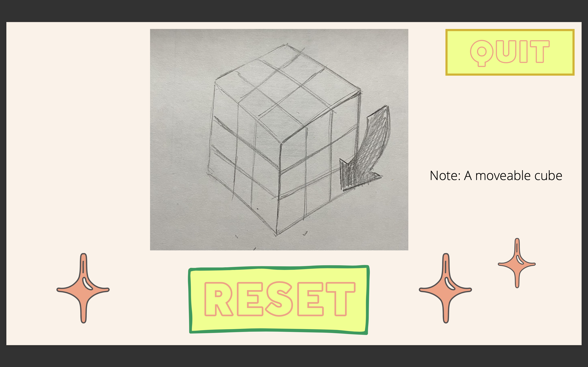
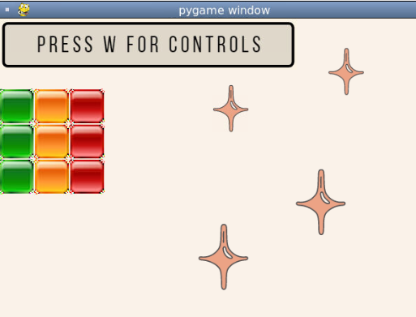
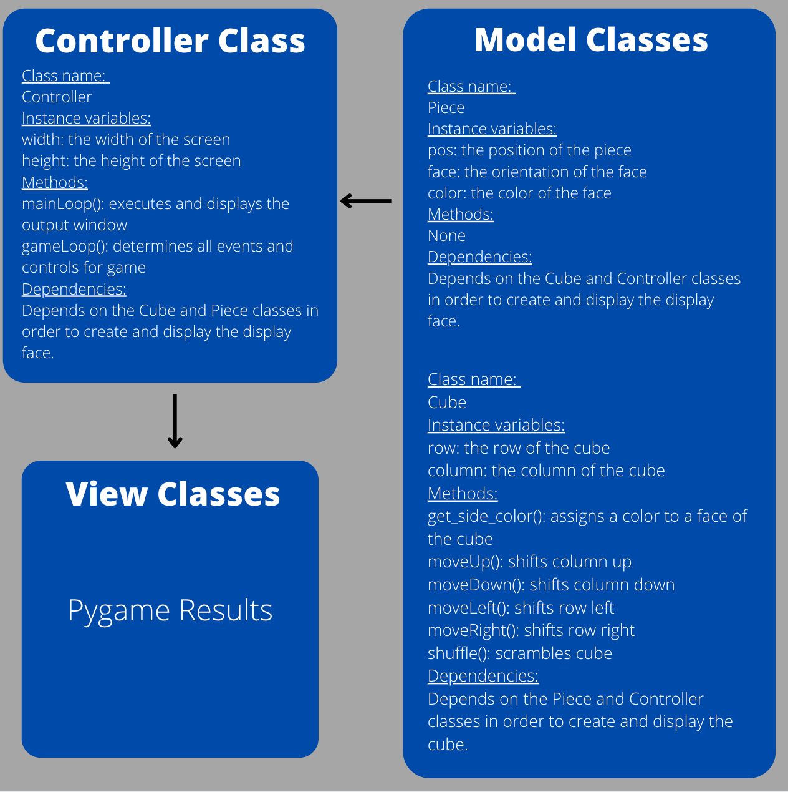

:warning: Everything between << >> needs to be replaced (remove << >> after replacing)
# CS110 Project Proposal
# Rubik's Cube
## CS 110 Final Project
### Spring Semester 2022
### [Assignment Description](https://docs.google.com/document/d/1H4R6yLL7som1lglyXWZ04RvTp_RvRFCCBn6sqv-82ps/edit#)

<< [[repl](https://replit.com/join/pwbhjuenhh-jaycob-aa)](#) >>

Link to Presentation Slides:(https://docs.google.com/presentation/d/12NakJV7317ZIsl4kpUUb4EA0p290iWoaFN8JRyrUQBA/edit?usp=sharing)]
Video: https://drive.google.com/file/d/1O1jezLfJ69F4xQOjFk2XtCz8XZ1NKyB1/view?usp=sharing 

### Team: Rubik's Cube Squad
#### Zain Mckay
#### Connie Deng
#### Jaycob White

***

## Project Description *(Software Lead)*

Our project is a virtual Rubik's cube. We display one face that can be interacted with by using the arrow keys to change colors and numbers 1-3 to select between rows/columns. 

***    

## User Interface Design *(Front End Specialist)*

* 
* 
* 

***        

## Program Design *(Backend Specialist)*

* Library: pygame
* Pygame:
    * https://www.pygame.org/docs/
    * Pygame is a library that contains many python modules, and is designed to write video games. 
* Modules: random, sys
    * Random Module:
        * https://docs.python.org/3/library/random.html
        * In our program, we used the random module in order to 'shuffle' the cube. This is done by setting a random amount of moves, either left, right, up, or down, a certain number of times.
* Class Interface Design
    * 
* Classes
    * Piece Class: creates a single piece that takes instance variables position, face, and color.
    * Cube Class: creates all faces of cube, top, bottom, front, back, left, and right. Also creates each face with 9 pieces from the piece class. Therefore the width and height is 3 when creating the standard rubik's cube.
    * Controller Class: executes and displays the results from the front end and back end code. Relies on both the piece class and the cube class. 

## Project Structure *(Software Lead)*

The Project is broken down into the following file structure:

* main.py
* src
    * <Controller.py
    * Cube.py
    * Piece.py>
* assets
    * <background.png
    * blueSq.png
    * classDiagram.png
    * greenSq.png
    * GUI.png
    * mainPg.png
    * orangeSq.png
    * presswforcontrols.png
    * redSq.png
    * whiteSq.png
    * yellowSq.png>
* etc
    * https://drive.google.com/file/d/1O1jezLfJ69F4xQOjFk2XtCz8XZ1NKyB1/view?usp=sharing  

***

## Tasks and Responsibilities *(Software Lead)*

   * You must outline the team member roles and who was responsible for each class/method, both individual and collaborative.

### Software Lead - Zain Mckay

Ensuring the front-end and back-end code worked together properly and assisted wherever I could in writing the code alongside my other teammates. 

### Front End Specialist - Connie Deng

Created front end code, ensured sprites appeared and oriented where they appeared, and made sure the controller class worked with the cube class. Also fixed some errors/bugs that we ran into, and cleaned up some code.

### Back End Specialist - Jaycob White

Created back end code, made sure that the cube class worked along with the piece class. Also, created movement of the rubik's cube.  

## Testing *(Software Lead)*

* Testing strategy mainly included print statements to see how far a loop would run before an issue occured and changing numbers to see how the image was affected.
    * Print("This works") 

## ATP

| Step                  | Procedure     | Expected Results  | Actual Results |
| ----------------------|:-------------:|:-----------------:|:--------------:|
|  1  | Click the run button | Screen appears with rubik's cube |            |
|  2  | Click 1 | column 1 is selected |                 |
|  3  | Click 2 | Column 2 is selected |                  |  
|  4  | Click 3 | Column 0 is selected |                |    
|  5  | Click up arrow | Column is shifted up one face |                   | 
|  6  | Click down arrow | Column is shifted down one face |               | 
